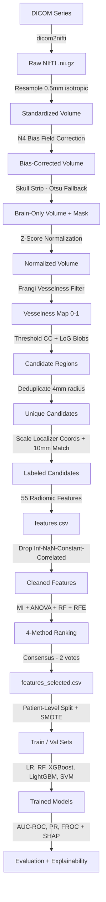

# 🧠 Intracranial Aneurysm Detection — ML Project

A classical Machine Learning pipeline for detecting and classifying intracranial aneurysms from **3D TOF-MRA** (Time-of-Flight Magnetic Resonance Angiography) brain scans. Built from scratch using hand-crafted radiomic features extracted from preprocessed NIfTI volumes.

---

## 📌 Project Overview

| Property | Detail |
|---|---|
| **Task** | Binary candidate-level classification (aneurysm vs. vessel segment) |
| **Data source** | RSNA 2025 Intracranial Aneurysm Detection AI Challenge (Kaggle) |
| **Modality** | TOF-MRA (MRA-only subset) |
| **Total series** | 458 MRA scans |
| **Approach** | Radiomic feature engineering + classical ML classifiers |
| **Key constraint** | Patient-level splits to avoid data leakage |

---

## 📂 Dataset

### Source
**RSNA 2025 Intracranial Aneurysm Detection** — [Kaggle Competition](https://www.kaggle.com/competitions/rsna-intracranial-aneurysm-detection)

- ~4,348 scans total (CTA + MRA combined)
- ~2,254 annotated aneurysms
- Annotated by 60+ expert radiologists across 18 institutions and 5 continents
- 13 distinct anatomical locations annotated

> This project uses only the **MRA modality subset**.

---

### Ground-Truth Aneurysm Masks

The aneurysm segmentation masks used for ground-truth label assignment were generated using the following public Kaggle preprocessing notebook:

> 📓 **[RSNA-01-Preprocessing by diyasilawat](https://www.kaggle.com/code/diyasilawat/rsna-01-preprocessing)**

The notebook produces per-case NPZ mask files. These were downloaded and packaged as **`results.zip`**.

The script `extract_aneurysm_locations.py` then reads these NPZ files, identifies non-zero voxels (aneurysm sites), and exports their 3D coordinates to `aneurysm_locations.csv` for use in candidate-level label assignment.

| File | Description |
|---|---|
| `results.zip` | NPZ segmentation masks from the Kaggle notebook |
| `aneurysm_locations.csv` | Extracted 3D aneurysm coordinates per case |

> [!NOTE]
> `results.zip` is excluded from this repository (too large). Download it by running the Kaggle notebook linked above, then extract it into the project root.

---

### MRA Subset (`balanced_mra_train.csv`)

| Property | Value |
|---|---|
| **Total series** | 458 |
| **Columns** | 18 |
| **Missing values** | None |

#### Patient Demographics

| Metric | Value |
|---|---|
| Sex (Female / Male) | 332 (72.5%) / 126 (27.5%) |
| Mean Age | 58.0 years |
| Median Age | 60.0 years |
| Age Range | 19 – 89 years |

#### Class Distribution (Balanced)

| Label | Count | % |
|---|---|---|
| Aneurysm Present (1) | 240 | 52.4% |
| No Aneurysm (0) | 218 | 47.6% |

#### Aneurysm Locations (13 anatomical sites)

| Location | Positive Cases | % of Total |
|---|---|---|
| Right Supraclinoid ICA | 60 | 13.1% |
| Left Supraclinoid ICA | 52 | 11.4% |
| Anterior Communicating Artery | 34 | 7.4% |
| Right Middle Cerebral Artery | 28 | 6.1% |
| Left Middle Cerebral Artery | 25 | 5.5% |
| Left Infraclinoid ICA | 14 | 3.1% |
| Right Infraclinoid ICA | 14 | 3.1% |
| Basilar Tip | 12 | 2.6% |
| Other Posterior Circulation | 11 | 2.4% |
| Right Posterior Communicating Artery | 8 | 1.7% |
| Left Posterior Communicating Artery | 7 | 1.5% |
| Right Anterior Cerebral Artery | 6 | 1.3% |
| Left Anterior Cerebral Artery | 5 | 1.1% |

#### Multi-location Cases

| # of Locations | Patients |
|---|---|
| 0 (no aneurysm) | 218 |
| 1 location | 211 |
| 2 locations | 22 |
| 3 locations | 7 |

---

## ⚙️ Full Pipeline Architecture



---

## 🧪 Stage 1 — DICOM → NIfTI Conversion

**Script:** `full_preprocessing.py` (or `preprocess_parallel.py` for multi-core)

| Item | Detail |
|---|---|
| Library | `dicom2nifti` |
| Input | DICOM folders (`/series/<SeriesInstanceUID>/`) |
| Labels | `balanced_mra_train.csv` |
| Output | `nifti_raw/<SeriesInstanceUID>.nii.gz` |
| Skip logic | Idempotent — already-converted files are skipped |

> [!NOTE]
> DICOM orientation and slice-increment validation are disabled (`d2n_settings.disable_validate_*`) to handle non-standard clinical MRA outputs.

---

## 🔬 Stage 2 — Image Preprocessing

**Script:** `full_preprocessing.py` → `preprocess_nifti()`

Each raw NIfTI volume passes through **6 sequential sub-steps**. All intermediates are written to a per-case temp directory and **automatically deleted** after completion.

| Step | Method | Purpose |
|---|---|---|
| 1. Spatial Resampling | `sitk.sitkLinear` → **(0.5, 0.5, 0.5) mm** isotropic | Normalize physical scale across patients |
| 2. N4 Bias Correction | `sitk.N4BiasFieldCorrectionImageFilter` (iters: [20, 20, 10]) | Remove MRI scanner inhomogeneity artifacts |
| 3. Skull Stripping | Otsu threshold + erosion/dilation + largest CC | Isolate brain tissue, remove skull |
| 4. Z-Score Normalization | `(voxel − μ_brain) / σ_brain` | Standardize intensity across scans |
| 5. Frangi Vesselness | `skimage.filters.frangi` (σ: [1.0, 2.0, 3.0]) | Highlight vascular tube-like structures |
| 6. Save Output | `<UID>_final.nii.gz` | Only final vesselness map is persisted |

### ⚡ Parallel Preprocessing (Multi-core)

For large datasets, `preprocess_parallel.py` + `preprocess_worker.py` significantly speed up Stage 1 & 2 by distributing work across multiple CPU cores.

| Component | Role |
|---|---|
| `preprocess_parallel.py` | Orchestrator — manages the job queue using `ThreadPoolExecutor` |
| `preprocess_worker.py` | Isolated subprocess — runs the full preprocessing pipeline for a single case |

**Architecture:**
- **DICOM → NIfTI:** 8 threads (I/O-bound)
- **Preprocessing:** Up to 6 parallel subprocesses (each isolated, ~3–4 GB RAM peak)
- Each subprocess is fully independent — no shared memory, no pickling, crash-safe

> [!NOTE]
> Both scripts must be in the same folder. Tune `PREPROCESS_WORKERS` based on available RAM (32 GB → 6 workers, 64 GB → 12 workers).

---

## 🎯 Stage 3 — Feature Extraction & Candidate Labeling

**Script:** `feature_extraction_v2.py`

### Candidate Generation

| Method | Description |
|---|---|
| **Threshold + CC** | Vesselness > 0.15 → connected components, 8–50,000 voxels |
| **LoG Blob Detection** | Applied to axial MIP; σ ∈ [2.0, 20.0], 12 sigma levels |
| **Deduplication** | Candidates within **4 mm** are merged (keep highest vesselness) |

### Candidate Label Assignment

Ground-truth coordinates from `train_localizers.csv` (originally 512×512 px) are scaled to NIfTI voxel space.

| Case Type | Condition | Label |
|---|---|---|
| Negative scan | All candidates | `0` — confirmed negative |
| Positive + localizer | Within **10 mm XY** of known aneurysm | `1` — confirmed positive |
| Positive + localizer | Farther than 10 mm | `0` — hard negative |
| Positive, no localizer | All candidates | `-1` — ambiguous (excluded or treated as weak positive) |

### Feature Groups (~55 features per candidate)

| Group | Features |
|---|---|
| **Vesselness Stats** | mean, std, min, max, range, median, p10/25/75/90, IQR, skewness, kurtosis, energy (mean-squared), entropy, CoV |
| **Shape / Morphology** | volume (vox & mm³), surface area (mm²), sphericity [0,1], bbox dims, elongation, flatness, compactness, equiv. diameter |
| **Texture** | Sobel gradient (mean/std/max), shell contrast, peak-to-shell ratio, GLCM proxy energy |
| **Blob Geometry** | solidity, extent, major/minor axis length, axis ratio |
| **Spatial Context** | Z/Y/X centroid in mm, depth ratio, distance to image edge |
| **Case-Level** | 13 artery-location binary flags, patient age, patient sex |

---

## 🧹 Stage 4 — Feature Selection

**Script:** `feature_selection.py`

### Phase A — Cleaning

| Step | Action |
|---|---|
| Inf/NaN imputation | Replace with column median |
| Quasi-constant removal | Drop features with variance < 0.01 |
| Collinearity filter | Drop one feature from each pair with Pearson \|r\| > 0.95 |

### Phase B — Multi-Method Consensus

Top-K (K = max(10, N//2)) features selected per method, each casting one vote:

| Method | What it captures |
|---|---|
| **Mutual Information (MI)** | Non-linear statistical dependency |
| **ANOVA F-Test** | Linear class separability |
| **Random Forest Importance** | Ensemble-based non-linear importance |
| **RFE (Logistic Regression)** | Iterative coefficient-based wrapper pruning |

**Consensus Rule:** Features with **≥ 2 votes** are retained in the final set.

### Outputs

| File | Content |
|---|---|
| `preprocessed/features_selected.csv` | Final reduced dataset |
| `feature_selection_plots/correlation_heatmap.png` | Correlation matrix after cleaning |
| `feature_selection_plots/rf_importance_selected.png` | RF importance for selected features |
| `feature_selection_plots/consensus_votes.png` | Per-feature vote count bar chart |
| `feature_selection_plots/mi_vs_rf_scatter.png` | MI vs RF importance scatter plot |

---

## 🤖 Stage 5 — Model Training & Evaluation

**Notebook:** `rsna_aneurysm_ml(1).ipynb` (Google Colab)

### Dataset Statistics at Training Time

| Metric | Value |
|---|---|
| Total candidates | 59,479 |
| Unique patients | 432 |
| Positive (label=1) | 4,440 (7.5%) |
| Negative (label=0) | 55,039 (92.5%) |
| Missing values | 0 |
| Detection methods | Blob LoG: 33,875 / Threshold CC: 25,604 |
| Avg. candidates / patient | 137.7 (std: 46.3, range: 12–383) |

### Pipeline Steps

1. **Load Data** — `features_selected.csv` (22 columns × 59,479 rows)
2. **EDA** — Class distribution, feature distributions, correlation
3. **Dimensionality Reduction** — PCA & ICA visualization
4. **Preprocessing + Patient-Level Split** — `GroupKFold` to avoid data leakage
5. **Handle Class Imbalance** — SMOTE oversampling
6. **Model Training** — 5 classifiers × 3 feature variants (raw, PCA, ICA):

| Classifier | Notes |
|---|---|
| Logistic Regression | Balanced class weights |
| Random Forest | 200 trees, max_depth=10, balanced weights |
| XGBoost | Gradient boosting |
| LightGBM | Fast gradient boosting |
| SVM | Balanced class weights |

7. **Evaluation** — AUC-ROC, AUC-PR, FROC curve
8. **Threshold Tuning** — Optimizing decision threshold for clinical use
9. **SHAP Analysis** — Feature importance explainability
10. **Model Export** — Best model saved via `joblib`

---

## 📁 Project File Structure

```
Machine Learning/
├── mra_subset_dataset/
│   ├── series/                    # Raw DICOM folders (one per SeriesInstanceUID) [gitignored]
│   └── balanced_mra_train.csv     # Labels + metadata for all 458 series
├── preprocessed/                  # [gitignored] — regenerate via pipeline scripts
│   ├── <UID>/<UID>_final.nii.gz   # Final Frangi vesselness maps
│   ├── features.csv               # Full extracted features (all candidates)
│   ├── features_selected.csv      # Consensus-selected features
│   └── feature_selection_plots/   # Visualization outputs
├── results.zip                    # NPZ masks from Kaggle notebook [gitignored — download separately]
├── aneurysm_locations.csv         # Extracted 3D aneurysm coordinates
├── full_preprocessing.py          # DICOM → NIfTI + preprocessing pipeline (single-core)
├── preprocess_parallel.py         # Multi-core preprocessing orchestrator ⚡
├── preprocess_worker.py           # Isolated subprocess worker (used by preprocess_parallel.py)
├── feature_extraction_v2.py       # Candidate generation + feature extraction
├── feature_selection.py           # Multi-method feature selection
├── extract_aneurysm_locations.py  # Parses results.zip NPZ masks → aneurysm_locations.csv
├── fix_candidate_labels.py        # Label correction utilities
├── evaluate_rates.py              # Pipeline evaluation helper
├── inference_pipeline.py          # Inference on new DICOM series
├── rsna_aneurysm_ml(1).ipynb     # Model training & evaluation (Colab)
├── .gitignore                     # Excludes large data files from Git
└── README.md                      # This file
```

---

## 🔧 Requirements

```
nibabel
SimpleITK
scikit-image
dicom2nifti
numpy
pandas
scipy
scikit-learn
xgboost
lightgbm
shap
imbalanced-learn
matplotlib
seaborn
joblib
```

---

## 🚀 Usage

### Step 1: Preprocess DICOM scans

You can run this step using a single core, or use the parallelized version to significantly speed up processing by utilizing multi-core CPUs.

**Option A — Multi-core (Recommended):**
```bash
python preprocess_parallel.py
```

**Option B — Single-core:**
```bash
python full_preprocessing.py
```

### Step 2: Extract ground-truth coordinates from masks
```bash
python extract_aneurysm_locations.py
```

### Step 3: Extract features from preprocessed volumes
```bash
python feature_extraction_v2.py \
    --preprocessed_dir path/to/preprocessed \
    --train_csv balanced_mra_train.csv \
    --localizer_csv train_localizers.csv \
    --output features.csv \
    --drop_ambiguous
```

### Step 4: Run feature selection
```bash
python feature_selection.py
```

### Step 5: Train and evaluate models
Open `rsna_aneurysm_ml(1).ipynb` in Google Colab and run all cells.

### Step 6: Run inference on a new DICOM series
```bash
python inference_pipeline.py --dicom_dir path/to/dicom/series
```

---

## 📊 Key Design Decisions

| Decision | Rationale |
|---|---|
| Candidate-level labeling (not case-level) | Avoids storm of false positives from treating all vessel segments as positive |
| Spatial 10 mm radius threshold | Balances precision of ground-truth matching vs. annotation uncertainty |
| Frangi vesselness as intermediate representation | Concentrates information in vascular structures, improves signal/noise for candidate generation |
| Hard negatives from positive scans | Improves model discrimination by training on difficult examples |
| Parallel preprocessing via subprocesses | No pickling, crash-isolated, scales to multi-core CPUs without OOM cascades |
| Patient-level GroupKFold | Prevents data leakage between train/val splits |
| Consensus feature selection | More robust than any single method; reduces overfitting risk |
| SMOTE | Addresses 12:1 class imbalance at the candidate level |
